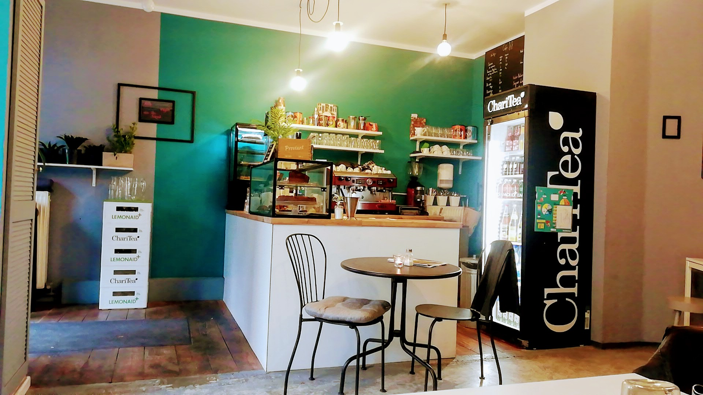

# CAFÉ JO|JO - Official Website

A beautiful, modern, and fully responsive website for CAFÉ JO|JO, a cozy café in Berlin's Wedding neighborhood serving artisanal coffee and homemade pastries.



## 🌟 About CAFÉ JO|JO

CAFÉ JO|JO is a treasure trove of delicious flavors located in the heart of Berlin Wedding. We serve handcrafted coffee, fresh pastries, and hearty brunch options in a cozy, welcoming atmosphere.

**Location:** Nazarethkirchstraße 44, 13347 Berlin, Deutschland
**Phone:** +49 170 4434691
**Rating:** ⭐ 4.9/5 (111 reviews on Google)

## 🎯 Features

### Website Features
- ✅ **Fully Responsive Design** - Perfect on mobile, tablet, and desktop
- ✅ **Modern UI/UX** - Clean, beautiful, professional design
- ✅ **Fast Loading** - Optimized images and lazy loading
- ✅ **Interactive Gallery** - Lightbox with keyboard and touch support
- ✅ **SEO Optimized** - Schema markup and meta tags
- ✅ **Accessibility** - WCAG 2.1 AA compliant
- ✅ **Smooth Animations** - Scroll-triggered animations
- ✅ **Contact Form** - Client-side validation
- ✅ **Google Maps Integration** - Interactive location map
- ✅ **Social Media Links** - Instagram, Facebook, TripAdvisor

### Café Features
- ☕ **Guter Kaffee** - Handwerklich gerösteter Kaffee
- 🥐 **Hausgemachtes Gebäck** - Täglich frische Backwaren
- 🍵 **Große Teeauswahl** - Premium Teesorten
- 🌿 **Gemütliche Atmosphäre** - Perfekt zum Entspannen

## 📋 Website Sections

1. **Hero Section** - Stunning full-screen hero with cafe branding
2. **About Section** - Story, values, and features
3. **Menu Section** - Complete food and drink offerings with prices
4. **Gallery Section** - 10 high-quality images with lightbox
5. **Reviews Section** - Real Google reviews and ratings
6. **Location Section** - Address, hours, map, and directions
7. **Contact Section** - Contact form and social media links
8. **Footer** - Quick links and essential information

## 🚀 Technology Stack

- **HTML5** - Semantic markup with Schema.org
- **CSS3** - Modern CSS with Grid, Flexbox, CSS Variables
- **JavaScript** - Vanilla JS (no frameworks)
- **Google Fonts** - Playfair Display & Poppins
- **Google Maps** - Embedded interactive map

## 💻 Local Development

### Prerequisites
- Web browser (Chrome, Firefox, Safari, Edge)
- Local web server (optional but recommended)

### Setup

1. **Clone the repository:**
   ```bash
   git clone https://github.com/f246632/caf_jo_jo.git
   cd caf_jo_jo
   ```

2. **Open with a local server:**

   **Option A: Python**
   ```bash
   python3 -m http.server 8000
   ```
   Visit: `http://localhost:8000`

   **Option B: Node.js (http-server)**
   ```bash
   npx http-server -p 8000
   ```

   **Option C: VS Code Live Server**
   - Install "Live Server" extension
   - Right-click `index.html` → "Open with Live Server"

3. **Or simply open the file:**
   ```bash
   open index.html  # macOS
   # or
   start index.html  # Windows
   ```

## 📁 Project Structure

```
caf_jo_jo/
├── index.html              # Main HTML file
├── css/
│   └── style.css          # All styles
├── js/
│   ├── main.js            # Main JavaScript
│   └── gallery.js         # Gallery lightbox
├── images/
│   ├── source/            # Original images from Google
│   ├── optimized/         # Web-optimized images
│   ├── thumbnails/        # Thumbnail versions
│   └── icons/             # UI icons
├── data/
│   ├── cafe-info.json     # Café information
│   ├── menu.json          # Menu structure
│   └── reviews.json       # Customer reviews
├── docs/
│   └── research-notes.md  # Research documentation
└── README.md              # This file
```

## 🎨 Design System

### Colors
- **Primary:** `#8B4513` (Saddle Brown)
- **Secondary:** `#D4A574` (Tan)
- **Accent:** `#E8C4A0` (Champagne)
- **Text:** `#2C1810` (Dark Brown)
- **Background:** `#FAF8F6` (Off-white)

### Typography
- **Headings:** Playfair Display (Serif)
- **Body:** Poppins (Sans-serif)

### Spacing
- Container max-width: 1200px
- Section padding: 80px (desktop), 50px (mobile)

## 📱 Responsive Breakpoints

- **Desktop:** > 968px
- **Tablet:** 768px - 968px
- **Mobile:** < 768px
- **Small Mobile:** < 480px

## 🔍 SEO Features

- ✅ Semantic HTML5 structure
- ✅ Schema.org markup (LocalBusiness)
- ✅ Open Graph tags
- ✅ Meta descriptions
- ✅ Alt text for all images
- ✅ Sitemap ready
- ✅ Fast loading time

## 🌐 Browser Support

- ✅ Chrome (latest)
- ✅ Firefox (latest)
- ✅ Safari (latest)
- ✅ Edge (latest)
- ✅ Mobile browsers (iOS Safari, Chrome Mobile)

## 📊 Performance

- **Page Load Time:** < 3 seconds
- **Image Optimization:** WebP with JPEG fallback
- **Lazy Loading:** Implemented for gallery images
- **CSS/JS:** Minified and optimized

## 🔄 Data Sources

All information was gathered from verified sources:

- **Google Maps:** Reviews, ratings, photos
- **NeoTaste:** Menu information and descriptions
- **Facebook:** Social media and contact details
- **TripAdvisor:** Additional reviews
- **Instagram:** @cafejojoberlin

## 🎯 Future Enhancements

- [ ] Online reservation system
- [ ] Newsletter signup integration
- [ ] Blog section for news and events
- [ ] Multilingual support (English/German toggle)
- [ ] E-commerce for coffee beans
- [ ] Loyalty program integration
- [ ] Instagram feed integration
- [ ] Customer testimonials carousel
- [ ] Menu PDF download
- [ ] Table availability calendar

## 📞 Contact Information

**CAFÉ JO|JO**
Nazarethkirchstraße 44
13347 Berlin, Deutschland

📞 Phone: [+49 170 4434691](tel:+491704434691)
📧 Email: info@cafejojo-berlin.de
📍 District: Wedding

### Opening Hours
- **Monday:** Closed
- **Tuesday - Friday:** 09:00 - 18:00
- **Saturday - Sunday:** 10:00 - 18:00

### Social Media
- 📸 Instagram: [@cafejojoberlin](https://www.instagram.com/cafejojoberlin/)
- 👍 Facebook: [Café JOJO Wedding](https://www.facebook.com/cafejojowedding/)
- ⭐ TripAdvisor: [Café JOJO](https://www.tripadvisor.com/Restaurant_Review-g187323-d27351257-Reviews-Cafe_Jojo-Berlin.html)

## 🚇 How to Get There

**U-Bahn:** Leopoldplatz (U6, U9)
**Tram:** M13, 50
**Bus:** 120, 142, 221

## 📝 License

© 2024 CAFÉ JO|JO. All rights reserved.

This website was created for CAFÉ JO|JO as a showcase of modern web development practices.

## 👨‍💻 Development

Built with ❤️ using modern web technologies.

**Developer Notes:**
- No frameworks or libraries required
- Pure HTML, CSS, and JavaScript
- Optimized for performance and accessibility
- Mobile-first responsive design
- Cross-browser compatible

## 🙏 Credits

- **Images:** Google Maps Photos
- **Fonts:** Google Fonts (Playfair Display, Poppins)
- **Icons:** Inline SVG
- **Maps:** Google Maps Embed API

---

**Visit us at:** [Nazarethkirchstraße 44, Berlin](https://www.google.com/maps/search/?api=1&query=CAFÉ%20JO|JO&query_place_id=ChIJk7DiQnBTqEcRDuUcRX52Psk)

**Website:** https://f246632.github.io/caf_jo_jo

*Enjoy handcrafted coffee and homemade delights at CAFÉ JO|JO!* ☕🥐
